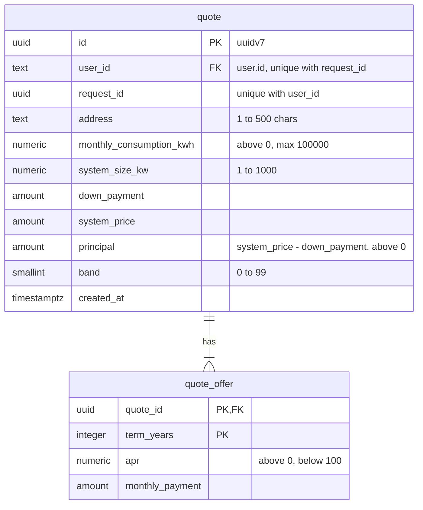

# Solar financing calculator

Enter your details and get a system price, a risk band and three installment offers (5, 10 and 15 years).

## Run

```bash
pnpm install
cp .env.example .env     # then set BETTER_AUTH_SECRET (openssl rand -base64 32)
docker compose up -d     # Postgres :5432, Keycloak :8080
pnpm dev                 # http://localhost:3000, must be this port: Keycloak calls back to it
```

- Seeded users: `admin@test.com` / `admin`, `user@test.com` / `user`. Sign up is open.
- Keycloak admin: http://localhost:8080, `admin` / `admin`. Realm `financing` from `docker/keycloak/financing-realm.json`.
- `NEXT_PUBLIC_PRICE_PER_KW` in `.env` sets the price of 1 kW for the app and the Postgres money limit. It is read at build time and when the Postgres volume is created.
- Postgres runs `docker/postgres/*.sql` and Keycloak imports the realm only on first start. After changing them (or the price), reset with `docker compose down -v && docker compose up -d`.

### Docker

`Dockerfile` builds a production image (`output: "standalone"`), with a healthcheck on `/api/health`.

```bash
docker compose --profile app up -d --build   # app on :3000 next to Postgres and Keycloak, stop `pnpm dev` first
docker compose ps                            # app shows (healthy) once Postgres answers
```

The browser reaches Keycloak at `KEYCLOAK_ISSUER` (`localhost:8080`), the container at `KEYCLOAK_INTERNAL_URL` (`keycloak:8080`). Keycloak (`KC_HOSTNAME_BACKCHANNEL_DYNAMIC`) answers the container with token and key URLs on `keycloak:8080` and the public issuer, so tokens match either way.

## Pages

- `/` quote form. Signed-out visitors are sent through Keycloak sign in first.
- `/quotes` the user's own quotes, newest first, 10 per page (`?page=2`).
- `/admin/quotes` every user's quotes with their owner. Admins only, others get a 404.

Both lists render `app/quotes/quotes.tsx` with a scope (`user` or `admin`). It reads one page from Postgres on the server, and the table runs in the browser so dates show in the viewer's time zone. UI is shadcn with Base UI (`pnpm dlx shadcn@latest add <name>`).

## Auth

Better Auth with Keycloak (`lib/auth.ts`), sessions in Postgres.

- Name ("first last"), email and the realm role `admin` are copied from Keycloak on every sign in, so a role change applies at the next sign in.
- Sign out ends both the app and the Keycloak session.
- When a Keycloak session ends anywhere, Keycloak calls `POST /api/backchannel-logout` and the app ends **all** sessions of that user.

## Database

Schema in `docker/postgres/*.sql`. `user`, `session`, `account` and `verification` come from Better Auth. Each quote is saved in `quote` with its offers in `quote_offer`, and is never changed or deleted.



Money uses the `amount` type: `numeric(12, 2)`, whole cents, from 0 to 1000x the biggest possible price. Row level security lets a user see only their own quotes and an admin see all, and nobody can add a quote for someone else.

The app connects as `financing` and sets `app.user_id` per transaction (`data/quote-store.ts`). It refuses to start, or to open a connection, if its role is a superuser or has `bypassrls` (`data/db.ts`, `instrumentation.ts`). `superuser` only runs the setup scripts.

`docker/postgres/04-seed.sql` seeds the test users, their accounts and quotes. The realm file pins the user ids the accounts link to. Regenerate with `pg_dump --data-only --column-inserts -t '"user"' -t quote -t quote_offer`, plus the account rows without tokens.

## Scripts

| Script                         | What it does                                                                        |
| ------------------------------ | ----------------------------------------------------------------------------------- |
| `pnpm test`                    | Jest unit tests                                                                     |
| `pnpm test:e2e:install`        | One-time Chromium download                                                          |
| `pnpm test:e2e`                | Playwright tests, needs `docker compose up -d` (builds the app and runs it on 3100) |
| `pnpm lint`                    | ESLint                                                                              |
| `pnpm format` / `format:check` | Prettier write / check                                                              |

## API

`POST /api/quotes` with a JSON body and a signed-in session cookie. Name and email come from the session, never the body. All rules live in `lib/quote.ts`.

| Field                   | Rule                                              |
| ----------------------- | ------------------------------------------------- |
| `requestId`             | UUID, the same on every retry of one quote        |
| `address`               | Text, 1 to 500 characters, no NUL byte            |
| `monthlyConsumptionKwh` | Number above 0, max 100000, at most 2 decimals    |
| `systemSizeKw`          | Number 1 to 1000, at most 2 decimals              |
| `downPayment`           | Optional (default 0), cents only, below the price |

Price is `systemSizeKw * NEXT_PUBLIC_PRICE_PER_KW`, rounded to cents. A repeat of a saved `requestId` saves nothing, so a retry never adds a duplicate. The form makes the id from the inputs and a random value per page load.

| Status | Body                                                                                                                                            |
| ------ | ----------------------------------------------------------------------------------------------------------------------------------------------- |
| `200`  | `{ systemPrice, band, offers: [{ termYears, apr, principalUsed, monthlyPayment }] }`. Also sent if saving fails for a temporary reason (logged) |
| `400`  | Body is not JSON: `{ errors: { form } }`                                                                                                        |
| `401`  | Not signed in: `{ errors: { form } }`                                                                                                           |
| `422`  | Invalid input, or data Postgres refuses: `{ errors: { <field>, form? } }`                                                                       |
| `500`  | Unexpected error: logged, no details                                                                                                            |

## Notes

Assumptions and open decisions, also marked `NOTE:` in the code.

- **Consumption limit** (`lib/quote.ts`): the max of 100000 kWh a month is a picked number, about 100x the biggest house (~1000 kWh).
- **Down payment** (`lib/quote.ts`): it only has to be below the price. How low the principal may go (a minimum loan) is a business decision.
- **Risk band** (`lib/quote.ts`): the spec did not say how `systemSizeKw` affects the band. Assumed a bigger system means a bigger principal, so a better rate.
- **Band column** (`docker/postgres/03-quotes.sql`): stored as a number, not a letter, so new bands need no data migration. `data/quote-store.ts` maps letters to numbers.
